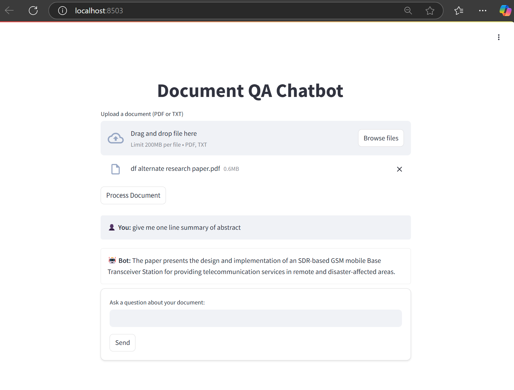

# 📄 Document QA Chatbot using LangChain and OpenAI

This project is a Document Question-Answering Chatbot built using LangChain, OpenAI GPT, FAISS, and Streamlit.

🚀 Purpose:
Many people, especially researchers and students, spend a lot of time reading long documents or research papers just to find specific information. This chatbot simplifies the process by allowing users to:

✅ Upload a document (PDF/TXT)  
✅ Ask questions about its content  
✅ Receive quick & accurate answers  

Instead of reading an entire paper, you can instantly extract key insights by simply asking specific questions like:  
💬 "Summarize the abstract in one sentence."  
💬 "What methodology was used?"  
💬 "List the key findings of this paper."  
This makes research faster, more efficient, and user-friendly!  

---

## 🚀 Demo
 
*(A screenshot of the working chatbot UI.)*

---

## 🛠 Features
✅ Upload **PDF** or **TXT** documents  
✅ Extracts **chunks of text** for better retrieval  
✅ Uses **FAISS vector store** for efficient document search  
✅ Integrates **LangChain** for advanced querying  
✅ Remembers **chat history** for multi-turn conversations  
✅ Provides **accurate** and **contextual answers**  

---

## 🏗 Tech Stack
- **Python 3.9+**
- **LangChain**
- **OpenAI GPT API**
- **FAISS**
- **Streamlit** (for UI)
- **PyPDFLoader** (to handle PDFs)

---

## 📥 Installation Guide (Step-by-Step)

1️⃣ Clone the Repository
First, clone this repository to your local machine:
```bash
git clone https://github.com/mujeebawan/Document-QA-Chatbot.git
cd Document-QA-Chatbot
```
2️⃣ Set Up a Virtual Environment
Now, create a virtual environment and activate it:

```bash
# Create a virtual environment (only once)
python -m venv .venv  

# Activate the virtual environment
# On Windows:
.\.venv\Scripts\activate

# On macOS/Linux:
source .venv/bin/activate
```
3️⃣ Install Required Dependencies
Run the following command to install all necessary Python packages:
```bash
pip install -r requirements.txt
```

4️⃣ Set Up OpenAI API Key
You need an OpenAI API Key to use GPT-based responses.

Get your API key from: OpenAI
Create a .env file in the root directory and add:

```env
OPENAI_API_KEY=your_openai_api_key_here

```
---

▶️ Running the Chatbot
Once everything is installed, you can start the chatbot:
```bash
streamlit run main.py
```

After running the above command, the terminal will show:
You can now view your Streamlit app in your browser.

  Local URL: http://localhost:8502
  Network URL: http://192.168.0.110:8502

Open http://localhost:8502 in your browser to interact with the chatbot.

---

### 🎮 Usage Guide  
**Upload a Document 📂**

- Click "Browse Files" and select a PDF or TXT file.  
- Click "Process Document" to load the content into the chatbot.  

**Ask Questions ❓**

Type a question related to the document.  
Example: "Summarize the abstract in one sentence."  

**Get AI Responses 🤖**

The bot will extract relevant information from the document.  
It uses memory, so you can ask follow-up questions!  

---

### 🗂 Project Structure

```bash
📂 Document-QA-Chatbot/
│── .venv/                 # Virtual environment (ignore in Git)
│── main.py                # Streamlit app (runs the chatbot)
│── requirements.txt        # Required dependencies
│── README.md               # This file!
│── .env                    # OpenAI API key (should be created by user)
│── image.png               # Screenshot of chatbot UI

```
---

### ⚡ Troubleshooting & FAQs

*❓ My chatbot is not responding!*  
Make sure your *OpenAI API Key* is correctly set in .env.  
Ensure all dependencies are installed: pip install -r requirements.txt.  
Check your internet connection.  
❓ I get an error saying **ModuleNotFoundError: No module named 'langchain'!**   
Run the command:  

```bash
pip install langchain
```

*❓ How do I stop the chatbot?*  
Simply press CTRL + C in the terminal.  

---

### 📌 Future Enhancements

🔹 Add support for multiple file uploads  
🔹 Enhance UI with better styling  
🔹 Improve retrieval accuracy with embeddings tuning  

---

### ❤️ Contributing

Want to improve this project? Feel free to submit a pull request or open an issue!  

---

### 📜 License

This project is licensed under the MIT License.  

---

### 📬 Need Help?
If you run into any issues, feel free to ask on GitHub Issues or reach out via email.

📌 Happy Coding! 🎉
